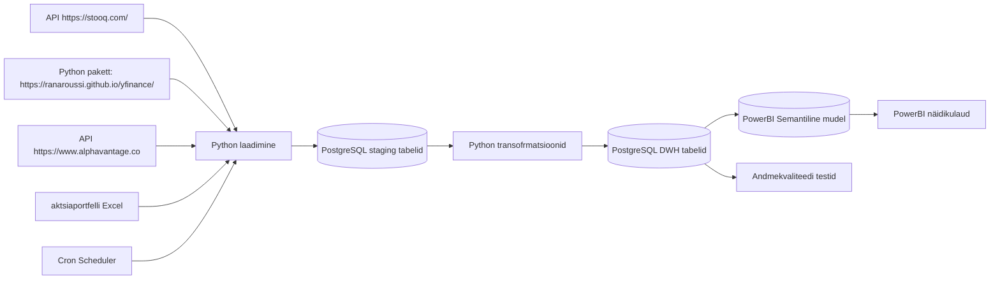

# AGRA — Väärtpaberiportfelli jälgimine

## Äriküsimus

Soov on luua isiklik väärtpaberiportfelli jälgimise lahendus ühe inimese portfelli alusel, arvestades, et hiljem saavad ka teised tiimiliikmed enda aktsiaportfellidega liituda.

**Mõõdikud:**

1. Portfelli kogutootlus (%) - Näitab kogu portfelli kasvu valitud perioodil
2. Päevane / nädalane / kuine tootlus - Võimaldab jälgida lühiajalist muutust
3. Average Buy price - kaalutud keskmine
4. Realiseeritud kasum/kahjum - Kui palju kasumit teeniti müüdud positsioonidest
5. Realiseerimata kasum/kahjum - Avatud positsioonide hetkeseis
6. Tehingute arv perioodis
7. Keskmine hoidmisperiood 
8. P/E Ratio - Price / Earnings
9. Dividend Yield - Dividenditootlus
10. Market Cap - Ettevõtte suurus


## Arhitektuur



Täpsem kirjeldus: [`docs/arhitektuur.md`](docs/arhitektuur.md)

## Andmestik

| Allikas | Tüüp | Ajas muutuv? | Roll |
|---|---|---|---|
| https://stooq.com/ | API | jah, iga päev | Põhiandmevoog |
| https://ranaroussi.github.io/yfinance/ | Python'i pakett | jah, iga päev | Põhiandmevoog |
| https://www.alphavantage.co | API | jah, iga päev | Põhiandmevoog |
| aktsiaportfelli Excel | Excel | muutub iga tehinguga  | masterdata | 


## Stack

| Komponent | Tööriist |
|-----------|---------|
| Sissevõtt | Python|
| Transformatsioon | SQL, Python |
| Andmehoidla | PostgreSQL |
| Näidikulaud | Power BI  |
| Orkestreerimine | cron |

## Käivitamine

```bash
# 1. Klooni repo ja liigu kausta
git clone https://github.com/rkapp22/PortfolioTracker.git
cd PortfolioTracker

# 2. Kopeeri keskkonnamuutujad
cp .env.example .env

# 3. Käivita teenused
docker compose up -d --build

# 4. Run the full pipeline once (ingest -> transform)
docker compose exec app python src/run_pipeline.py
#   (or: make pipeline)
```

## Näidikulaud
Näidikulaua avamiseks on vajalik kasutaja arvutis PowerBI Dekstop rakendust ( [Windows only](https://www.microsoft.com/en-us/power-platform/products/power-bi/downloads) )

Näidikualud on failis Dashboard.pbip 


--Täiendamisel-----------
```bash
# 2. Kopeeri keskkonnamuutujad
cp .env.example .env
# Muuda .env failis paroolid ja muud seaded vastavalt vajadusele

# 3. Käivita teenused
docker compose up -d --build

# 4. [Vabatahtlik: käivita sissevõtt käsitsi esimesel korral]
# docker compose exec pipeline python scripts/run_pipeline.py run-all
```

Airflow (kui kasutatakse): http://localhost:8080 (kasutaja: airflow / parool: airflow)
Näidikulaud: http://localhost:[PORT]

## Saladused ja konfiguratsioon

Kõik saladused (paroolid, API võtmed, andmebaasi URL-id) on `.env` failis. Repos on ainult `.env.example`, mis näitab vajalike muutujate struktuuri ilma tegelike väärtusteta. Päris `.env` faili ei tohi GitHubi panna - see on `.gitignore`-s.

Vajalikud muutujad:

| Muutuja | Tähendus | Näide |
|---------|----------|-------|
| `DB_PASSWORD` | PostgreSQL parool | (saladus) |
| `[teised]` | ... | ... |

## Andmevoog lühidalt

1. **Sissevõtt** — Andmed laetakse allika API'sid või juba olemasolevaid Python paketti kasutades.
2. **Laadimine** — Laadimine `staging` kihti toimub loodud Python paketi abil
3. **Transformatsioon** — [Kirjelda peamised arvutused ja mudelid]
4. **Testimine** — [Mitu] andmekvaliteedi testi kontrollivad korrektsust
5. **Näidikulaud** — [Kirjelda lühidalt, mida näidikulaud näitab] Näidikulauana kasutatakse powerBI Desktop faili. Käivitatav ja värskendatav kasutaja lokaalses arvutis.

## Andmekvaliteedi testid

Projekt kontrollib järgmist:

1. [Test 1 - nt: kasutajate ID on unikaalne]
2. [Test 2 - nt: tellimuse summa pole null]
3. [Test 3 - nt: kuupäev jääb vahemikku 2020-2026]
[Lisa rohkem, kui sul on]

Testide tulemused: [kuhu salvestatakse / kuidas vaadata]

## Projekti struktuur

```
.
├── README.md
├── compose.yml
├── .env.example
├── .gitignore
├── docs/
│   ├── arhitektuur.md      ← nädal 1 väljund
│   └── progress.md         ← nädal 2 väljund
└── ...                     ← ülejäänud projektifailid
```

## Kokkuvõte, puudused ja võimalikud edasiarendused

**Kokkuvõte:**
- [Loetle, mis on lõpule viidud, mis töötab hästi]

**Puudused:**
- [Loetle ausalt, mis jäi tegemata - see ei mõjuta hinnet negatiivselt, vaid aitab hinnata]

**Mis edasi:**
- [Mida tahaksid edasi teha, kui aega oleks rohkem]

## Meeskond

| Nimi | Roll |
|------|------|
| Gerdo German  | Kvaliteedi omanik ja vajadusel Transformatsioonide omanik|
| Rait Käpp | Andmeallika omanik ja vajadusel  Kvaliteedi omanik|
| Aleksandra Kuld  | Transformatsioonide omanik |
| Annela Velleste | Näidikulaua omanik |
