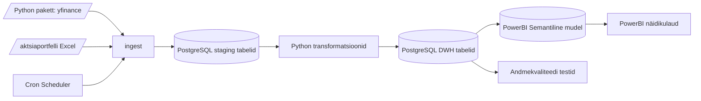

# AGRA — Väärtpaberiportfelli jälgimine

## Äriküsimus

Soov on luua isiklik väärtpaberiportfelli jälgimise lahendus ühe inimese portfelli alusel, arvestades, et hiljem saavad ka teised tiimiliikmed enda aktsiaportfellidega liituda.

**Mõõdikud:**

1. Portfelli kogutootlus (%) - Näitab kogu portfelli kasvu valitud perioodil
2. Päevane / nädalane / kuine tootlus - Võimaldab jälgida lühiajalist muutust
3. Average Buy price - kaalutud keskmine
4. Realiseeritud kasum/kahjum - Kui palju kasumit teeniti müüdud positsioonidest
5. Realiseerimata kasum/kahjum - Avatud positsioonide hetkeseis
6. Tehingute arv perioodis
7. Keskmine hoidmisperiood 
8. P/E Ratio - Price / Earnings
9. Dividend Yield - Dividenditootlus
10. Market Cap - Ettevõtte suurus


## Arhitektuur


```mermaid
flowchart LR
    source1[/Python pakett: yfinance/] --> ingest
    source2[/aktsiaportfelli Excel/] --> ingest
    ingest --> staging[(PostgreSQL staging tabelid)]
    staging --> transform[Python transformatsioonid]
    transform --> mart[(PostgreSQL DWH tabelid)]
    mart --> semantic_model[(PowerBI Semantiline mudel)]
    semantic_model --> dashboard[PowerBI näidikulaud]
    mart --> quality[Andmekvaliteedi testid]
    scheduler[Cron Scheduler] --> ingest
```

Täpsem kirjeldus: [`docs/arhitektuur.md`](docs/arhitektuur.md)

## Andmestik

| Allikas | Tüüp | Ajas muutuv? | Roll |
|---|---|---|---|
| https://ranaroussi.github.io/yfinance/ | Python'i pakett | jah, iga päev | Põhiandmevoog; väärtpaberi üldandmed ja hinna aegread|
| https://api.frankfurter.dev/v1 | Python'i pakett | jah, iga päev | Põhiandmevoog; valuutakursid |
| aktsiaportfelli Excel | Excel | muutub iga tehinguga  | Alusandmed; väärtpaberite ostud ja müügid | 


## Stack

| Komponent | Tööriist |
|-----------|---------|
| Sissevõtt | Python|
| Transformatsioon | SQL, Python |
| Andmehoidla | PostgreSQL |
| Näidikulaud | Power BI  |
| Orkestreerimine | cron |

Transformatsioonid on Python'is sest osa projektitöö osalistest on basic grupist.
<br>
Näidikulauana on kasutuses Microsoft'i Power BI, sest see oli projektitöö osalistele varasemalt tuttav lahendus. Lahendus on disainitud töötama kasutaja lokaalses arvutis (Alusandmed Excelist ja visualiseerimine Power BI Desktop rakendusega).

## Käivitamine

```bash
# 1. Klooni repo ja liigu kausta
git clone https://github.com/rkapp22/PortfolioTracker.git
cd PortfolioTracker

# 2. Kopeeri keskkonnamuutujad
cp .env.example .env

# 3. Käivita teenused
docker compose up -d --build

# 4. Run the full pipeline once (ingest -> transform)
docker compose exec app python src/run_pipeline.py
#   (or: make pipeline)

# 5. Ava rakendusega PowerBI Desktop (Windows only) fail 
Dashboard.pbip
```

## Näidikulaud
Näidikulaua avamiseks on vajalik kasutaja arvutis PowerBI Dekstop rakendust ( [Windows only](https://www.microsoft.com/en-us/power-platform/products/power-bi/downloads) )

Näidikualud on failis Dashboard.pbip 

Pärast avamist on vaja Home ribbon'ilt vali **Refresh** et laadida värske seis andmelaos.

## Saladused ja konfiguratsioon

Kõik saladused (paroolid, API võtmed, andmebaasi URL-id) loetakse jooksvalt failist `.env`. Repos on ainult `.env.example`, mis näitab vajalike muutujate struktuuri ilma tegelike väärtusteta. Päris `.env` faili ei tohi GitHubi panna — see on `.gitignore`-s.

Alljärgnevalt on loetletud keskkonnamuutujad, mida torujuht kasutab, koos näidiste väärtustega (võetud projektis leiduvast `.env`-failist):

| Muutuja | Tähendus | Näide |
|---------|----------|-------|
| `POSTGRES_USER` | PostgreSQL kasutajanimi | portfolio |
| `POSTGRES_PASSWORD` | PostgreSQL parool | portfolio |
| `POSTGRES_DB` | PostgreSQL andmebaasi nimi | portfolio |
| `DB_HOST_PORT` | Hostis avalikustatud PostgreSQL port | 5432 |
| `EXCEL_PATH` | Tee konteineri sees Exceli portfellifaili | /data/sample_portfolio.xlsx |
| `BASE_CURRENCY` | Aruandluse / baasvaluuta (EUR) | EUR |
| `RUN_MODE` | Orkestreerimise režiim: `manual` või `cron` | manual |

~~Airflow (kui kasutatakse): http://localhost:8080 (kasutaja: airflow / parool: airflow)~~

Märkus: tundlikud väärtused (nt paroolid) jäta alati oma lokaalsesse `.env`-faili ega jaga neid avalikult. Kopeeri esmalt `.env.example` → `.env` ja kohanda väärtused vastavalt oma keskkonnale.

## Andmevoog lühidalt

1. **Sissevõtt** — Andmeid saadakse käsitsi täidetava Exceli ja vabavaraliste Pythoni pakettide kaudu.
2. **Laadimine** — Laadimine `staging` kihti toimub loodud `pandas` paketi abil.
3. **Transformatsioon** — tranformeeritakse `staging` kihist `dwh` kihti. Moodustatakse aktsiate omamise, omandamise ja valuutakursi tabelid.
4. **Testimine** — [Mitu] andmekvaliteedi testi kontrollivad korrektsust ##TODO.
5. **Näidikulaud** — Kuvatakse aktsiaportfelli tootlust vastaval perioodil erinevate enimlevinud näidikute abil. Näidikulauana kasutatakse PowerBI Desktop faili. Käivitatav ja värskendatav kasutaja lokaalses arvutis.

## Andmekvaliteedi testid -- TODO

Projekt kontrollib järgmist:

1. [Test 1 - nt: kasutajate ID on unikaalne]
2. [Test 2 - nt: tellimuse summa pole null]
3. [Test 3 - nt: kuupäev jääb vahemikku 2020-2026]
[Lisa rohkem, kui sul on]

Testide tulemused: [kuhu salvestatakse / kuidas vaadata]

## Projekti struktuur

```
.
├── README.md
├── compose.yml
├── .env.example
├── .gitignore
├── docs/
│   ├── arhitektuur.md      ← nädal 1 väljund
│   └── progress.md         ← nädal 2 väljund
└── ...                     ← ülejäänud projektifailid
```

## Kokkuvõte, puudused ja võimalikud edasiarendused

**Kokkuvõte:**
- [Loetle, mis on lõpule viidud, mis töötab hästi]
- Docker'i konteinerid töötavad
- andmete integreerimine toimib
- andmete transformatsioon töötab
- Andmebaasi staging ja dwh skeemad saavad täidetud
- Näidikulaua mustand on olemas

**Puudused:**
- [Loetle ausalt, mis jäi tegemata - see ei mõjuta hinnet negatiivselt, vaid aitab hinnata]

**Mis edasi:**
- [Mida tahaksid edasi teha, kui aega oleks rohkem]
- cron'i asemel rakendada Airflow
- Transformatsioonid realiseerida dbt'ga
- Näidikulauana kasutada veebi-põhist rakendust nagu Superset või Metabase

## Meeskond

| Nimi | Roll |
|------|------|
| Gerdo German  | Kvaliteedi omanik ja vajadusel Transformatsioonide omanik|
| Rait Käpp | Andmeallika omanik ja vajadusel  Kvaliteedi omanik|
| Aleksandra Kuld  | Transformatsioonide omanik |
| Annela Velleste | Näidikulaua omanik |
