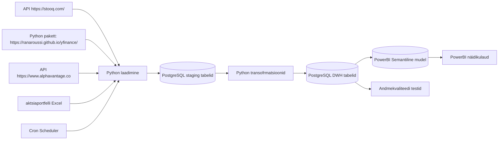

# AGRA — Väärtpaberiportfelli jälgimine

## Äriküsimus

Soov on luua isiklik väärtpaberiportfelli jälgimise lahendus ühe inimese portfelli alusel, arvestades, et hiljem saavad ka teised tiimiliikmed enda aktsiaportfellidega liituda.

**Mõõdikud:**

1. Portfelli kogutootlus (%) - Näitab kogu portfelli kasvu valitud perioodil
2. Päevane / nädalane / kuine tootlus - Võimaldab jälgida lühiajalist muutust
3. Average Buy price - kaalutud keskmine
4. Realiseeritud kasum/kahjum - Kui palju kasumit teeniti müüdud positsioonidest
5. Realiseerimata kasum/kahjum - Avatud positsioonide hetkeseis
6. Tehingute arv perioodis
7. Keskmine hoidmisperiood 
8. P/E Ratio - Price / Earnings
9. Dividend Yield - Dividenditootlus
10. Market Cap - Ettevõtte suurus

## Andmevoog

## Andmebaasi kihid

| Kiht | Roll |
|------|------|
| `staging` | Hoiab allika andmeid töötlemata kujul |
| `dwh` | Hoiab transformeeritud ja ärilogikat sisaldavaid tabeleid |
| `Semantiline mudel` | hoiab näidikulaua andmemudelit |

## Tööjaotus

| Roll | Vastutus | Täitja |
|------|----------|--------|
| Infra omanik | Paneb üles Docker'i lahenduse | Rait Käpp |
| Andmeallika omanik | Kirjutab sissevõtu loogika, hoiab API-t töös | Gerdo Germann |
| Transformatsioonide omanik | Kirjutab DWH kihi mudelid ja mõõdikute arvutuse | Aleksandra Kuld, Rait Käpp |
| Kvaliteedi omanik | Kirjeldab testide loogika, realiseerib testid ja vaatab läbi ebaõnnestunud kontrollid | Annela Velleste, Gerdo Germann |
| Näidikulaua omanik | Ehitab näidikulaua ja seob selle äriküsimusega | Annela Velleste, Aleksandra Kuld |

## Riskid

| Risk | Mõju | Maandus |
|------|------|---------|
| API ei vasta | värske andmete seis on puudu | teatud arv korduspäringuid. enne ei kustata staging kihist eelmsit seisu, kui uus on olemas |
| API tagastab ebakvaliteetse sisu | oht kahjustada andlao infot | laadimisprotseduur peab kontrollima uut infot enne üle kirjutamist |
| Teadlik või ettevaatamatu eksitud andmelaos |  andmete terviklikus rikutud, valed otsused | järgmise laadimisega saab korda, seniks hoitustede näidikulaual |

## Privaatsus ja turve

Lahendus ei sisalda isikuandmeid. Sisaldab tundlikke andmeid (investeerimisportfelli ostud ja müügid - "aktsiaportfelli Excel"). Andmebaasi paroolid tulevad `.env` failist. Lahendus on plaanitud jooksma kasutaja lokaalses arvutis, Docker'i konteineris ning ei publitseeri avalikku võrku midagi. 