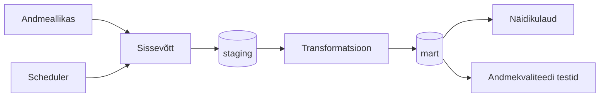

# AGRA — Väärtpaberiportfelli jälgimine

## Äriküsimus

Soov on luua isiklik väärtpaberiportfelli jälgimise lahendus ühe inimese portfelli alusel, arvestades, et hiljem saavad ka teised tiimiliikmed enda aktsiaportfellidega liituda.

**Mõõdikud:**

1. Portfelli kogutootlus (%) - Näitab kogu portfelli kasvu valitud perioodil
2. Päevane / nädalane / kuine tootlus - Võimaldab jälgida lühiajalist muutust
3. Average Buy price - kaalutud keskmine
4. Realiseeritud kasum/kahjum - Kui palju kasumit teeniti müüdud positsioonidest
5. Realiseerimata kasum/kahjum - Avatud positsioonide hetkeseis
6. Tehingute arv perioodis
7. Keskmine hoidmisperiood 
8. P/E Ratio - Price / Earnings
9. Dividend Yield - Dividenditootlus
10. Market Cap - Ettevõtte suurus

## Andmevoog

> Täpsusta diagrammi vastavalt oma projektile — lisa rohkem andmeallikaid, mudeleid või teenuseid.

## Andmebaasi kihid

| Kiht | Roll |
|------|------|
| `staging` | Hoiab allika andmeid töötlemata kujul. |
| `mart` | Hoiab transformeeritud ja ärilogikat sisaldavaid tabeleid. |

## Tööjaotus

| Roll | Vastutus | Täitja |
|------|----------|--------|
| Andmeallika omanik | Kirjutab sissevõtu loogika, hoiab API-t töös | Rait Käpp |
| Transformatsioonide omanik | Kirjutab mart kihi mudelid ja mõõdikute arvutuse | Aleksandra Kuld |
| Kvaliteedi omanik | Kirjutab testid ja vaatab läbi ebaõnnestunud kontrollid | Gerdo German |
| Näidikulaua omanik | Ehitab näidikulaua ja seob selle äriküsimusega | Annela Velleste |

## Riskid

| Risk | Mõju | Maandus |
|------|------|---------|
| [Risk 1 — näiteks: API ei vasta] | [Mis juhtub?] | [Kuidas maandad?] |
| [Risk 2] | [Mis juhtub?] | [Kuidas maandad?] |
| [Risk 3] | [Mis juhtub?] | [Kuidas maandad?] |

## Privaatsus ja turve

[Kirjelda, millised isiku- või tundlikud andmed teie projektis esinevad (kui üldse) ja kuidas neid kaitsete. Isikuandmed peavad olema anonümiseeritud. Andmebaasi paroolid peavad tulema `.env` failist.]
